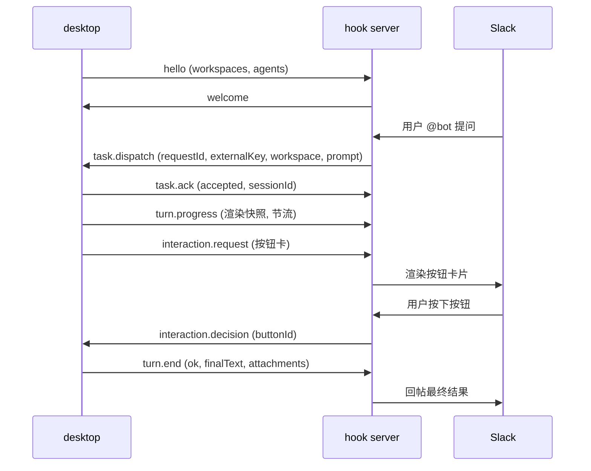

# slack-hook-protocol — hook server ↔ desktop 双工任务协议

> 包:`@cindy/slack-hook-protocol` · 协议版本 `HOOK_PROTOCOL_VERSION = 1` · 传输:WebSocket 文本帧(JSON)
> 两端:**desktop**(客户端,发起连接)与 **hook server**(外部渠道接入服务,当前渠道为 Slack 与协商启用的 Telegram、X (Twitter))。包名本版保留以避免消费方迁移风险。

## 1. 协议模型(四幕 + v2 增量)

协议围绕「把 IM 渠道里的消息变成桌面端 agent 任务,再把结果送回渠道」设计:

1. **连接自报家门**:`hello`(desktop → server,声明工作区别名与可用 agent)/ `welcome` / `ping` / `pong`
2. **派活**:`task.dispatch`(server → desktop)→ `task.ack`(立即三态应答)
3. **干活**:无消息——铁律「同 externalKey 同 session」由 desktop 侧保证
4. **交差**:`turn.end`(desktop → server,结果回传)；协商 `turn-delivery-v1` 后由
   `turn.delivery`(server → desktop)回报服务端接管、重试和渠道发布结果

v2 在版本号不变的前提下增量扩展(见 §3 兼容策略):

5. **绑定**:`bind.start` / `bind.update` / `bind.revoke` —— Slack 用户 ↔ 设备的建立与解除(Sign in with Slack OIDC)
6. **问答**:`query.request` / `query.response` —— `/bind` `/model` `/effort` 指令实时拉取工作区 / 模型清单
7. **取消**:`task.cancel` —— `/stop` 中断在跑任务,desktop 以 `turn.end(cancelled)` 收口
8. **归档**:`session.archive` —— 私聊 `/new` 换代后归档旧代会话
9. **进度**:`turn.progress` —— turn 执行中的渲染快照(节流,整帧替换语义)
10. **交互**:`interaction.request` / `interaction.decision` / `interaction.cancel` —— agent 执行中的用户交互(提问 / 计划审阅 / 权限审批)以按钮卡片转发到渠道
11. **偏好**:`prefs.get` / `prefs.set` / `prefs.state` —— server 侧目录偏好(agent/model/effort/permission)的远程读写
12. **工具**:`tool.request` / `tool.response` —— desktop 会话内 agent 调用 server 侧 Slack 网关工具(server 以绑定用户托管的 user token 执行);能力协商靠 `welcome.features` 的 `HOOK_FEATURE_SLACK_TOOLS`
13. **多 workspace 绑定(multi-team)**:`bind.state` 快照帧 + 各帧可选 `teamId` —— 一台设备可同时持有多个 (teamId, slackUserId) 绑定;能力协商双向(`hello.features` / `welcome.features` 的 `HOOK_FEATURE_MULTI_TEAM`),任一侧缺席回落单绑定行为
14. **多 provider**:`provider.bind.*` / `provider.prefs.*` —— 在不改变 Slack 旧帧的前提下追加统一的 provider 绑定与偏好通道
15. **最近会话**:`query.kind=sessions` —— Telegram `/session` 仅拉取最多 20 条脱敏会话摘要
16. **群消息中继(group-relay)**:`group.message` —— server 把群消息实时转发给该群已知绑定成员的桌面(fire-and-forget),滚动窗口与上下文拼装全部在 desktop 本地;基础能力协商双向(`HOOK_FEATURE_GROUP_RELAY='group-relay-v1'`)。接收方代际由追加能力 `HOOK_FEATURE_GROUP_RELAY_RECIPIENT='group-relay-recipient-v1'` 协商:server 按扇出目标填 `recipient{bindingId,principalId}`,desktop 仅在它与当前 confirmed binding 精确匹配时入窗
17. **上下线通知偏好**:`hello.lifecycleAnnouncement` 在握手时上报当前值,`lifecycle.preference`(desktop → server,`{ enabled: boolean }`)实时更新;desktop 仅在 `welcome.features` 包含 `HOOK_FEATURE_LIFECYCLE_ANNOUNCEMENT='lifecycle-announcement-v1'` 时发送实时更新帧
18. **收口后续跑**:`turn.reopen` —— 已收口任务在桌面端被用户续跑时,把后续进展接回渠道原消息;能力协商靠 `welcome.features` 的 `HOOK_FEATURE_TURN_REOPEN`
19. **Telegram 行为配置**:`provider.behavior.get` / `provider.behavior.set` / `provider.behavior.state` —— 在 `provider.prefs.*` 之外新增一条专管 Telegram 行为(emoji 回应、回复引用、群免 @ 白名单)的通道,选择器只认 `bindingId`(不接受 `scopeId`);能力协商靠双向 `HOOK_FEATURE_PROVIDER_BEHAVIOR='provider-behavior-v1'`。同期 `group.message.author` 追加可选 `id` / `username`(Telegram 数字 user id 与 @handle)

## 2. 核心设计原则

- **externalKey 不透明**:对协议是不透明字符串,由 hook server 的 provider 生成(格式约定 `<providerId>:...`),desktop 只拿它查 session 映射并原样回传。
- **workspace 是别名**:本地绝对路径只存在于 desktop,**永不过网线**。server 只能派发 `hello` 注册过的别名。
- **决策语义留在 desktop**:交互卡(阶段 10)中 server 是"哑渲染器"——渲染卡片、回传 `buttonId`,按钮到决策的映射、超时与安全默认全部由 desktop 持有。
- **确定性靠代码不靠对端自觉**:两端收帧唯一入口是 `parseHookMessage`,手写校验、零依赖、坏帧返回 `ok:false` + 字段路径,绝不抛异常。
- **sessionId 仅接管时指定**:普通流程 `task.dispatch.sessionId` 恒 null(按 externalKey 定位);非 null 表示接管已有桌面会话。ack / turn.end 中回传仅作记录,不参与路由。
- **provider 能力必须双向协商**:只有 hello 与 welcome 同时包含 `provider-bind-v1` / `provider-prefs-v1` / `session-picker-v1` 时才可使用对应新增帧;每个 provider-neutral 渠道还要求 server 的 welcome 包含对应的 `provider:<id>` 标识(Telegram = `provider:telegram`,X = `provider:x`)。任一能力缺席都隐藏该渠道并完整回落现有 Slack 路径。
- **provider 偏好隔离**:`provider.prefs.*` 用 `provider + bindingId/scopeId + workspace` 定位,不会读取或覆写旧 `prefs.*` 的 Slack 行。provider-neutral 条目刻意不含 `teamId`。

## 3. 信封与兼容策略

每一帧都是同一形状的信封:

```ts
interface HookEnvelope<TType, TPayload> {
  v: number; // 恒为 HOOK_PROTOCOL_VERSION(1),不等直接拒收
  type: TType; // 消息类型,见 §5
  id: string; // 发送方生成的帧唯一标识(日志/去重);业务关联一律走 payload.requestId
  ts: number; // 发送方时钟 unix ms,仅供诊断
  payload: TPayload;
}
```

**兼容策略(重要,扩展协议前必读)**:

- `v` 固定为 1,靠以下两条实现无版本号演进:
  - **type 是开放集合**:老端收到未知 `type` **丢帧不断连**。新消息类型天然向后兼容(功能降级但不致故障)。
  - **字段级宽容**:校验器只查已知字段,未知字段静默忽略(如 `turn.end.attachments` 对旧 server);新增可选字段的缺省行为必须定义(如 `bind.update.installUrl` 缺省回退通用链接)。
- 生命周期通知偏好采用显式滚动升级语义:
  - **新 desktop → 旧 server**:旧 server 忽略 `hello.lifecycleAnnouncement`;因 `welcome.features` 不含 `lifecycle-announcement-v1`,desktop 不发送 `lifecycle.preference`,server 保持既有“通知开启”行为。
  - **旧 desktop → 新 server**:缺省 `hello.lifecycleAnnouncement` 按 `true` 处理,保持升级前通知行为。
  - **新 desktop → 新 server**:server 先采用 hello 中的握手值;声明 `lifecycle-announcement-v1` 后,desktop 才可用 `lifecycle.preference` 即时覆盖当前设备偏好。
- 本次只追加新消息类型、能力字符串和 `query.kind=sessions`;既有 `bind.*` / `prefs.*` 类型、字段与构造结果保持不变。老端会丢弃未知 provider 帧,新端在能力缺席时不会发送它们。
- 帧上限 `HOOK_MAX_FRAME_CHARS = 48 MiB`(JSON 序列化后字符数)。纯防 OOM 的粗防御,取"能容纳几张聊天截图的 base64"的宽上限;附件精细限额由生产源头(provider)负责。

## 4. 可靠性语义

- **requestId 幂等**:任务重投不重跑,desktop 只回放上次 ack。
- **断线重连**:server 重投未 ack 的任务;desktop 补发未送达的 `turn.end`。双方协商
  `turn-delivery-v1` 时，desktop 以 `turn.delivery(state=accepted)` 作为 server 已持久
  接管结果与重试责任的边界；socket 本地写成功不等于渠道已发布。
- **latest-wins 帧**(`turn.progress` / `prefs.state` 主动推送):丢帧无害,每帧整体替换,不拼接不累积。
- **幂等收口**:`task.cancel` 对未知 requestId、`session.archive` 对不存在的会话、`interaction.decision` 对已收口交互——全部静默忽略。

## 5. 消息目录

### 阶段 1 连接与身份

| 消息            | 方向             | 用途 / 关键字段                                                                                                                                                                                                                                                                                                                                                                                                                                                                                                                              |
| --------------- | ---------------- | -------------------------------------------------------------------------------------------------------------------------------------------------------------------------------------------------------------------------------------------------------------------------------------------------------------------------------------------------------------------------------------------------------------------------------------------------------------------------------------------------------------------------------------------- |
| `hello`         | desktop → server | 建连后第一帧。`protocolVersion`、`deviceId`、`deviceName`、`workspaces`(注册的别名列表;首位恒为内置对话伪目录 `HOOK_CHAT_WORKSPACE_ALIAS='chat'`)、`agents`(可用 agent 类型)、可选 `features`(desktop 侧能力标识,如 `HOOK_FEATURE_MULTI_TEAM`)、可选 `lifecycleAnnouncement`(当前设备的上下线通知偏好;缺省按 `true`)、可选 `defaultWorkspace`(本连接的默认工作区别名;**必须是 `workspaces` 的成员**,校验器据此拒收;缺省 / `null` = 无默认,server 按各自既有规则决定,通常落 `chat`)。别名映射变更后重发 hello 即时生效(server 以最新一帧为准) |
| `welcome`       | server → desktop | 握手完成。`serverName`、`features`(server 侧能力标识,包括 `HOOK_FEATURE_SLACK_TOOLS` / `HOOK_FEATURE_MULTI_TEAM` / `HOOK_FEATURE_LIFECYCLE_ANNOUNCEMENT` / `HOOK_FEATURE_TURN_REOPEN`;空数组 = 均不支持)                                                                                                                                                                                                                                                                                                                                     |
| `ping` / `pong` | 双向             | 心跳,收到 ping 必须回 pong。payload 恒空对象                                                                                                                                                                                                                                                                                                                                                                                                                                                                                                 |

### 阶段 2/4/7/9 任务生命周期

| 消息            | 方向             | 用途 / 关键字段                                                                                                                                                                                                                                                                                                                                       |
| --------------- | ---------------- | ----------------------------------------------------------------------------------------------------------------------------------------------------------------------------------------------------------------------------------------------------------------------------------------------------------------------------------------------------- |
| `task.dispatch` | server → desktop | 派发任务。`requestId`、`externalKey`、`workspace`(sessionId 为 null 时必填)、`sessionId`(接管时非 null)、`prompt`、`options`(model/permissionMode/agentKind/effort 全可空,空落 desktop 默认)、`attachments`(base64 内联图片)、`source`(IM 来源元数据:平台、频道名、thread 上下文、用户原文)                                                           |
| `task.ack`      | desktop → server | dispatch 立即应答,三态 `accepted / queued / rejected`。联动约束(parse 强制):`reason` 仅 rejected 非 null;`queuePosition` 仅 queued 非 null;`sessionId` 在 accepted/queued 为目标会话、rejected 为 null。拒绝原因:`unknown_workspace` / `workspace_not_allowed` / `session_not_found` / `disabled` / `invalid`                                         |
| `turn.progress` | desktop → server | 执行中渲染快照(完整 markdown,整帧替换)。desktop 负责节流(约 1.5s/帧)与长度控制                                                                                                                                                                                                                                                                        |
| `task.cancel`   | server → desktop | 中断在跑任务(`/stop`)。desktop 中断对应 turn,以 `turn.end(cancelled)` 收口                                                                                                                                                                                                                                                                            |
| `turn.end`      | desktop → server | 任务收口。`status`:`ok / error / cancelled`(联动:ok 时 errorMessage 必须 null,error 时必须非空);`finalText`;`usage.durationMs`(拿不到就 null,不编造);`attachments`(agent 产出的图片/文件,出站与入站对称复用 TaskAttachment)                                                                                                                           |
| `turn.delivery` | server → desktop | 协商 `turn-delivery-v1` 后回报普通 `turn.end` 的交付状态：`accepted`=server 已接管结果及重试责任，`retrying`=渠道发布失败但会按 `retryAt` 自动重试，`delivered`=渠道终态动作已完成，`failed`=停止重试。带 `attempt`；retrying/failed 的 `error` 仅含安全结构化 code/message/retryable，不得透传 provider 原始响应、凭证或用户内容。续跑轮不使用本帧。 |
| `turn.reopen`   | desktop → server | (阶段 18)已收口任务在桌面端被用户续跑,把后续进展接回渠道那条消息。`requestId`(续跑轮的**新** id)、`reopenOf`(被续跑那轮的 id,parse 强制两者不相等)、`externalKey`、`sessionId`、`reason`(开放集合,当前只有 `user-continued`)。详见阶段 18                                                                                                             |

### turn.delivery 可靠性与兼容

- 双方必须在 `hello.features` / `welcome.features` 同时声明
  `HOOK_FEATURE_TURN_DELIVERY='turn-delivery-v1'` 后才启用。老 server 继续按既有
  fire-and-forget 行为处理；新 server 不向未声明能力的老 desktop 推未知帧。
- `accepted` 不是“WebSocket 收到”或“写入本机 socket”，而是最终结果已进入 server
  的持久交接/恢复边界；从这一刻起重试归 server。desktop 在 accepted 前可按同一
  `requestId` 重放完全相同的普通 `turn.end`，server 必须幂等并回放最新状态。
- `retrying` 的 `retryAt` 与 `error.retryable=true` 必填；`accepted` / `delivered` 不带
  error；`failed` 带安全结构化 error 且 `retryAt=null`。provider 的原始响应正文不得上 wire。
- `delivered` / `failed` 是渠道侧终态。服务端若要保证断线后仍可查询或回放终态，需保留
  有界 TTL 的 delivery receipt；仅在线 best-effort 发一帧不构成可靠发布确认。
- `turn.reopen` 续跑保持既有“断连即终局”语义，不进入普通 turn.end 的 ACK/重放链，
  避免迟到补发覆盖 server 已完成的断连收口。

### 阶段 5 绑定(Sign in with Slack OIDC)

| 消息          | 方向             | 用途 / 关键字段                                                                                                                                                                                                                                                                                                         |
| ------------- | ---------------- | ----------------------------------------------------------------------------------------------------------------------------------------------------------------------------------------------------------------------------------------------------------------------------------------------------------------------- |
| `bind.start`  | desktop → server | 发起绑定。新端发空对象 `{}`(设备身份取连接 hello 的 deviceId);可选 `teamId` = 给指定 team 重新授权时 pin 授权页(缺省 = 用户在授权页自选);`email` 字段仅用于 server 识别旧客户端(deprecated)                                                                                                                             |
| `bind.update` | server → desktop | 绑定状态机推送:`none / pending / confirmed / denied / expired / failed / revoked`。联动:pending 时 `authorizeUrl` 非空;confirmed 时 `slackUserId` 非空(可选 `teamName`);failed 时 `message` 非空,可选结构化 `reason`(已知值 `not-installed`,配 `installUrl`)。可选 `teamId`:事件按 team 定位(pending 期团队未知为 null) |
| `bind.revoke` | desktop → server | 解除绑定。`{ teamId?, pendingOnly? }`:`teamId` 非空 = 只解绑该 team,空/缺省 = 解绑本设备全部(兼容单绑定老语义);`pendingOnly=true` = 只作废在途授权、不动已确认绑定。desktop 仅在 server 声明 multi-team 后才发带 `teamId` 的形态                                                                                        |
| `bind.state`  | server → desktop | (multi-team)绑定全量快照(权威列表):`bindings[]` 每项 `{ teamId, teamName, slackUserId, slackUserName }`。连接建立与任何绑定变化(新增/解除/被顶)后推送;旧 desktop 不认识本类型,丢帧不断连                                                                                                                                |

### 阶段 6 实时问答

| 消息             | 方向             | 用途 / 关键字段                                                                                                                                                                          |
| ---------------- | ---------------- | ---------------------------------------------------------------------------------------------------------------------------------------------------------------------------------------- |
| `query.request`  | server → desktop | 拉清单。`queryId`(server 生成,响应回传配对,server 自行超时)、`kind`:`workspaces / models / sessions`                                                                                     |
| `query.response` | desktop → server | 应答。`ok=false` 时 `error` 非空;ok 时按 kind 携带 `workspaces`、`agents` 或 `sessions`。sessions 最多 20 条 `{id,title,workspace,lastActiveAt}`,workspace 只能是别名,校验器拒绝绝对路径 |

### Provider-neutral 绑定与偏好

| 消息                                           | 方向             | 用途 / 关键字段                                                                                                                                                                                                                                                                                                                                                                            |
| ---------------------------------------------- | ---------------- | ------------------------------------------------------------------------------------------------------------------------------------------------------------------------------------------------------------------------------------------------------------------------------------------------------------------------------------------------------------------------------------------ |
| `provider.bind.start`                          | desktop → server | 按 provider 发起一次绑定尝试;`requestId` 配对,`scopeId` 可选                                                                                                                                                                                                                                                                                                                               |
| `provider.bind.cancel`                         | desktop → server | 只取消指定 `attemptId`,不影响任何 confirmed binding                                                                                                                                                                                                                                                                                                                                        |
| `provider.bind.revoke`                         | desktop → server | 只解除指定 `bindingId`                                                                                                                                                                                                                                                                                                                                                                     |
| `provider.bind.update` / `provider.bind.state` | server → desktop | 共用完整快照形状。状态:`none → pending → awaiting_confirmation? → confirmed`;终态:`denied / expired / failed / revoked / superseded`。pending 必带 HTTPS `connectUrl`、attemptId、expiresAt;confirmed 必带 bindingId、principalId、scopeId;denied/expired/failed 必带机器可读 reason 并清空 binding/principal/expiry 字段;revoked/superseded 保留 bindingId 但必须清空 attemptId/expiresAt |
| `provider.prefs.get` / `provider.prefs.set`    | desktop → server | 用 provider 与且仅一个 bindingId/scopeId 选择偏好域;set 再按 workspace alias 部分更新，校验器拒绝绝对路径                                                                                                                                                                                                                                                                                  |
| `provider.prefs.state`                         | server → desktop | 同一偏好域的全量快照;`bound=false` 时 prefs 必为空，workspace 同样只允许 alias                                                                                                                                                                                                                                                                                                             |

`actions` 是 UI 能力提示,当前值包括 `open_connect_url`、`copy_connect_url`、`cancel`、`retry`、`revoke`、`open_provider`、`add_to_group`;消费者必须忽略未来未知 action。链接仍需由 host 做 provider-specific allowlist 校验,例如 Telegram 客户端只接受严格的 `https://t.me/<bot>?start=<token>`。

### 阶段 19 Telegram 行为配置

| 消息                      | 方向             | 用途 / 关键字段                                                                                                                                                                                                                                                                                                                                                                                                                                                                                                                                                      |
| ------------------------- | ---------------- | -------------------------------------------------------------------------------------------------------------------------------------------------------------------------------------------------------------------------------------------------------------------------------------------------------------------------------------------------------------------------------------------------------------------------------------------------------------------------------------------------------------------------------------------------------------------- |
| `provider.behavior.get`   | desktop → server | 按 `provider`(目前仅 `telegram`)+ 必填 `bindingId` 拉取一份 Telegram 行为配置;`requestId` 配对。选择器与 `provider.prefs.*` 的 bindingId/scopeId 二选一不同,本选择器**只认 `bindingId`**,不接受 `scopeId` 代替                                                                                                                                                                                                                                                                                                                                                       |
| `provider.behavior.set`   | desktop → server | 部分更新。三个全局字段 `emojiReactions` / `replyQuoteDm` / `replyQuoteGroup` 均为 `枚举 \| null` 三态 patch:缺省(`undefined`)= 不动;显式枚举 = 设置/覆盖(即使等于当前默认值也要保留用户意图,不会被将来默认值变化悄悄改写);显式 `null` = 清除 override、回落到 `DEFAULT_TELEGRAM_BEHAVIOR`。可选 `groupActivation`(单条 `{chatId, value: TELEGRAM_GROUP_ACTIVATION_ALWAYS \| null}` patch,其中 `chatId` 必须是 Bot API 52-bit 范围内的规范负整数群/频道 id,`value=null` 表示清除该群的白名单条目)。至少要有一个实际改动(显式 `null` 也算)才是合法 patch,空 set 被拒收 |
| `provider.behavior.state` | server → desktop | 全量快照:三个全局字段是**已解析的** effective 非空枚举值(不是 patch,不接受 `null`/`undefined`);`groupActivation` 是 `{chatId: value}` 的完整 map,键遵循上述规范群 id 约束。map 不另设低于整帧的条目上限,确保每次合法 set 累积后仍可由 state 完整表达;统一受 `HOOK_MAX_FRAME_CHARS` 限制,解析时以常量额外内存单遍校验,不展开第二份 entries 数组。`bound=false` 时字段联动(parse 强制)收敛为默认值 + 空 map                                                                                                                                                            |

`DEFAULT_TELEGRAM_BEHAVIOR`(个人版出厂默认,未被 override 时的 effective 值):`emojiReactions='minimal'`、`replyQuoteDm='off'`、`replyQuoteGroup='first'`。能力协商靠双向 `HOOK_FEATURE_PROVIDER_BEHAVIOR='provider-behavior-v1'`;任一侧未声明则整条通道不可用,desktop 侧维持旧行为(不发 get/set,也不渲染 state)。

同期 `group.message.author`(见阶段 14 表)追加两个可选字段:`id`(Telegram 数字 user id 的十进制字符串,1-20 位,不含符号)、`username`(Telegram @handle,不含 `@` 前缀,仅 `[A-Za-z0-9_]`,1-32 位)。两个字段按 Telegram 当前实际契约收紧校验,即使 `group.message.provider` 本身仍是开放集合 —— 其它 provider 要复用这两个字段需先重新评估格式约束,不能直接套用同一正则。

### 阶段 8 会话归档

| 消息              | 方向             | 用途                                                                   |
| ----------------- | ---------------- | ---------------------------------------------------------------------- |
| `session.archive` | server → desktop | 归档 externalKey 绑定的会话。desktop 幂等:无绑定/不存在/已归档静默忽略 |

### 阶段 10 执行中交互

| 消息                   | 方向             | 用途 / 关键字段                                                                                                                                                                                                                                                                  |
| ---------------------- | ---------------- | -------------------------------------------------------------------------------------------------------------------------------------------------------------------------------------------------------------------------------------------------------------------------------- |
| `interaction.request`  | desktop → server | 转发 agent 交互为渠道无关卡片:`requestId`(定位回帖 thread)、`interactionId`(决策配对键)、`kind`(开放集合:`ask_user_question` / `plan_review` / 权限审批等,server 只透传不理解)、`title`、`body`(markdown)、`buttons`(≤ `MAX_INTERACTION_BUTTONS`=24;按钮 id 卡内唯一且不含 `\|`) |
| `interaction.decision` | server → desktop | 用户按了按钮,回传 `buttonId`。desktop 查自己登记的按钮→决策映射;迟到/未知静默忽略                                                                                                                                                                                                |
| `interaction.cancel`   | desktop → server | 交互已在 desktop 收口(超时自决/turn 结束),通知 server 改写卡片(摘按钮 + reason 文案),防止用户按死卡片。幂等                                                                                                                                                                      |

### 阶段 11 目录偏好

| 消息          | 方向             | 用途 / 关键字段                                                                                                 |
| ------------- | ---------------- | --------------------------------------------------------------------------------------------------------------- |
| `prefs.get`   | desktop → server | 拉取绑定用户全部目录偏好。`requestId` 由 `prefs.state.replyTo` 回显配对                                         |
| `prefs.set`   | desktop → server | 部分更新某目录偏好(undefined 不动、null 显式清空)。server 只做 shape 校验不校验值合法性                         |
| `prefs.state` | server → desktop | 全量快照。`replyTo` 回显请求 id;主动推送(渠道 `/model` 卡写入后)为 null。联动:`bound=false` 时 `prefs` 恒空数组 |

### 阶段 12 Slack 网关工具

| 消息            | 方向             | 用途 / 关键字段                                                                                                                                                                                                                                                               |
| --------------- | ---------------- | ----------------------------------------------------------------------------------------------------------------------------------------------------------------------------------------------------------------------------------------------------------------------------- |
| `tool.request`  | desktop → server | 调用 server 侧 Slack 网关工具。`requestId`(desktop 生成,response 回显配对)、`tool`(开放集合,当前约定 `status` / `listTools` / `callTool`;未知值 server 回 `UNKNOWN_TOOL` 而非丢帧)、可选 `args`。发送前先查 `welcome.features` 是否含 `HOOK_FEATURE_SLACK_TOOLS`,缺席直接短路 |
| `tool.response` | server → desktop | 应答。`replyTo` 回显 requestId;联动(parse 强制):`ok=false` 时 `error` 必须为非空 `{code, message}`(desktop 按 code 分支,不解析文案),`ok=true` 时 `error` 缺席或 null,`result` 形状由具体工具约定                                                                              |

### 阶段 13 多 workspace 绑定(multi-team)增量

新帧 `bind.state` 见阶段 5 表。其余为已有帧的可选 `teamId` 扩展(多绑定下的归属消歧,缺省 = 设备唯一绑定的旧语义):`bind.start` / `bind.update` / `bind.revoke`(见阶段 5)、`prefs.set` 与 `prefs.state` 条目、`tool.request`、`task.dispatch.source`(`teamId` + `teamName`,供会话标题与工具默认 team)。能力协商双向:desktop 在 `hello.features`、server 在 `welcome.features` 各自声明 `HOOK_FEATURE_MULTI_TEAM`,任一侧缺席则整体回落单绑定行为。

### 阶段 14 群消息中继(group-relay)增量

| 消息            | 方向             | 用途 / 关键字段                                                                                                                                                                                                                                                                                                                                                                                                                                                                                                                                                      |
| --------------- | ---------------- | -------------------------------------------------------------------------------------------------------------------------------------------------------------------------------------------------------------------------------------------------------------------------------------------------------------------------------------------------------------------------------------------------------------------------------------------------------------------------------------------------------------------------------------------------------------------- |
| `group.message` | server → desktop | 实时转发一条群消息,fire-and-forget(无 ack,桌面离线即丢)。`provider`(开放集合)、`recipient?{bindingId,principalId}`(协商 `group-relay-recipient-v1` 后必填,绑定本帧实际接收方代际)、`chatId` / `threadId`(null=主群流)/ `messageId`(反查 id,与 task.dispatch 引用块、桌面窗口条目同键关联)、`chatName`、`author{name,isBot?,id?,username?}`(`id`/`username` 为阶段 19 追加的可选字段,按 Telegram 契约收紧:`id` 是无前导零、Bot API 52-bit 范围内的规范十进制正整数,`username` 仅 `[A-Za-z0-9_]` 1-32 位)、`text`(≤4k,可空)、`fileNames?`(仅文件名)、`sentAt`(unix ms) |

`task.dispatch.source` 增加可选 `triggerMessageId`(与 `group.message.messageId` 同一 id 空间):desktop 据此在本地窗口中精确剔除"当前消息";旧 server 不发时 desktop 降级为不剔重。

设计边界(2026-07-28 决策):**群聊内容不得驻留在 server**(内存亦不允许)——server 收到群消息后对已声明 `group-relay-v1` 与 `group-relay-recipient-v1` 的成员桌面转发即弃;server 侧仅可存 `chatId ↔ principal` 成员元数据(id 级,无内容)用于路由。每个扇出帧的 `recipient` 必须来自发送当刻再次确认的 binding,不得复用消息作者或客户端当前状态推断。滚动窗口、增量游标与上下文拼装全部在 desktop 本地完成。与 Slack 通道「平台即存储、按需拉取」同构;Telegram 无历史 API,存储方为用户自己的设备。一次性凭证(如绑定深链 `/start <token>`)由 server 过滤,不转发。

### 上下线通知偏好

| 消息                   | 方向             | 用途 / 关键字段                                                                                                                                                                                                                       |
| ---------------------- | ---------------- | ------------------------------------------------------------------------------------------------------------------------------------------------------------------------------------------------------------------------------------- |
| `lifecycle.preference` | desktop → server | 即时更新当前设备的 Slack Bot 上下线通知偏好。payload 恒为 `{ enabled: boolean }`;desktop 仅在 `welcome.features` 包含 `HOOK_FEATURE_LIFECYCLE_ANNOUNCEMENT='lifecycle-announcement-v1'` 后发送。能力缺席时不发送,以握手兼容语义降级。 |

握手初值由 `hello.lifecycleAnnouncement` 提供。新 server 对字段缺省按 `true` 处理以兼容旧 desktop;旧 server 忽略该可选字段并继续按既有开启行为运行。这样无论先升级 desktop 还是 server,都不会因单边升级意外关闭既有通知。

### 默认工作目录(hello.defaultWorkspace)

**要解决的问题**:一次交互只有一条公开消息名额的渠道没有承载目录选择面板的位置。Slack 有 Block Kit、Telegram 有 inline keyboard,都能在会话里让用户当场挑目录;X 只能回一条推文,既没有交互控件,也不值得为选目录多花一条公开回帖(每条都计费)。结果是这类渠道的任务只能永远落在内置「对话」伪目录上,碰不到本地仓库。

**做法**:desktop 在握手时声明一个默认别名,server 在新建 lane 时按「本 lane 已定的目录 > `hello.defaultWorkspace` > `chat`」取值。不引入额外往返,也不占用正文字符。

**成员关系在协议层卡死**:`defaultWorkspace` 必须是 `workspaces` 的成员,校验器据此拒收。server 只能派发清单内的别名,默认值若能指向清单外,等于给这条约束开了后门 —— 而它恰恰是 server 侧派发校验的唯一依据。

**兼容**:字段可选。旧 desktop 不发即无默认,server 维持既有行为;旧 server 忽略该可选字段。desktop 侧目录被删除后必须把默认值归零后再握手,否则会因指向清单外的别名被拒收。

### 阶段 18 收口后的续跑(turn.reopen)

**要解决的问题**:`turn.end(status=error)` 之后,用户常在桌面端点错误横幅上的「重试」。那会在**同一个会话**里起一个新 turn(桌面端发的是一条隐藏续跑指令),任务确实继续跑了,但渠道那条消息永远停在失败上 —— `turn.progress` / `turn.end` 都以 `requestId` 为键,那一轮已经收口,协议里也没有任何"会话级"通道能让 desktop 主动往那条消息写东西。用户看到的就是「点了重试也没反应」。

**为什么用新 `requestId` + `reopenOf`,而不是复用原 id**:

- server 侧幂等语义不用改(原 `requestId` 的 `turn.end` 仍是一次性的,断线补发去重不受影响),只需把 `reopenOf` 指向的那条消息的位置登记给新 `requestId`,之后的 `turn.progress` / `turn.end` 走既有代码路径;
- `task.cancel` 能精确命中续跑轮(它带的是新 `requestId`);
- 一次续跑再失败、再被续跑时天然形成链条,每环都有自己的 id。

**路由面**:续跑 `requestId` 只承载 `turn.progress` / `turn.end` / `task.cancel`,**刻意不含 `interaction.*`**。续跑是用户在桌面端点出来的,人就在桌面前,那一轮里 agent 的提问 / 计划审阅 / 权限审批由桌面本地交互面直接处理,不绕回渠道;所以 server 不会收到带续跑 `requestId` 的 `interaction.request`,也不需要为它建立 thread 关联。反过来若把交互推回渠道,用户还得离开正在操作的桌面端去渠道点按钮,更绕。

`externalKey` 仅供日志与诊断关联,**不参与路由**:定位那条消息的唯一依据是 `reopenOf`。刻意不允许用 `externalKey` 兜底 —— 两端独立实现(server 闭源、独立仓),一端"映射过期就按 externalKey 找 thread"、另一端"映射过期就忽略",同一次过期续跑会在一端改写消息、在另一端丢弃。

**server 侧约定**:

- 认不出 `reopenOf`(映射已过期 / 消息已删)时**静默忽略**整条帧,并对随后到达的同 `requestId` 的 `turn.progress` / `turn.end` 一并忽略 —— 回流失败只是回到"消息停在失败上"的现状,不是错误,不要报错刷屏。更一般地:对**从未登记过**的 `requestId` 的 `turn.progress` / `turn.end` 一律静默忽略,不报错也不新建消息;
- 认得出时把那条消息改回进行中态,后续 progress 原地刷新、`turn.end` 定稿。渠道里**不新增消息**(用户抱怨的正是那条消息不动);
- 本帧必须**幂等**:同一 `(requestId, reopenOf)` 重复登记同一个位置,无副作用(断线重投时 desktop 可能重复发送);
- 不需要为续跑 `requestId` 关联 `interaction.*` —— 那些帧不会带着它到来;
- 收到一个**已经绑定到别的任务**的 `requestId` 时拒绝登记并忽略该帧,不得覆盖已有路由(见下面的 id 命名空间要求)。**并且要把该 `requestId` 隔离掉**:随后带着它到来的 `turn.progress` / `turn.end` 一并忽略,不得落到原有那条路由上。只拒 reopen 帧、却继续按老路由接收后续帧,等于把这条兜底作废 —— 续跑轮的进度与终态会改写、定稿那个无关任务的消息;
- **连接断开时必须收口该连接上所有"已 reopen 但还没收到 `turn.end`"的消息** —— 恢复成原来的终态,或改写成一句「续跑中断」。desktop 的续跑记账只在进程内,崩溃 / 重启后不会补发任何帧;没有这条清理,那些消息会永久停在假的"进行中"上,比本能力上线前更糟。收口是**权威的**:desktop 不会在重连后把这一轮的结果补回来(见下面 desktop 侧的"直发不缓存");
- 但收口**必须在真正落笔时校验所有权**:这条消息此刻是否仍归"被断开的那个连接 + 那一次 reopen"所有。渠道改写是异步的,而 desktop 可能在毫秒级重连、用户也可能立刻再点一次重试 —— 迟到的收口不得盖掉更新的一次 reopen 装上的进行中态、更不得盖掉已经到达的新终态。实现上给每条消息的归属挂一个连接 / 世代标记,收口时比对不上就丢弃,或把归属变更串行化。

**desktop 侧约定**:

- 只在 server 于 `welcome.features` 宣告 `HOOK_FEATURE_TURN_REOPEN`(`turn-reopen-v1`)时才发本帧;缺席则维持旧行为;
- 只有"用户在桌面端显式续跑"才触发 —— 桌面端在同一会话里问的其它问题不回流,否则渠道消息会被无关内容改写;
- 记账只在进程内(app 重启后原 `requestId` 已随进程消失),有 TTL;
- 只在**首个事件到达后**才发本帧:桌面端的续跑发送可能根本没被接受(排队被挡 / 凭证切换),先认领再发现没动静会让渠道消息停在假的"进行中";
- 但本帧必须排在**该 turn 的任何 `turn.progress` / `turn.end` 之前** —— 包括"首个观察到的事件本身就是终态"(例如立刻的凭证错误)。若先发 `turn.end`,server 会按未知 `requestId` 丢弃它,随后的 reopen 又把消息改成进行中,就再没有终态帧能收口了;
- 续跑轮的 `turn.progress` / `turn.end` **一律直发,不缓存、不在重连后补发**。这里**刻意偏离**第 3 节那条通用可靠性约定(「断线重连:desktop 补发未送达的 `turn.end`」):那条约定成立的前提是消息由 server 建立、断线期间没人动它,补发就能定稿;而续跑轮的消息在断连那一刻已经被 server 的断连收口改写,迟到的 `turn.end` 只会撞上一个已被解绑的 `requestId` 而被当成未知 id 丢弃 —— 结果是"实际跑成功了,渠道上却显示续跑中断"。协议因此把断连处理收敛成单一权威(server 收口),而不是让两端各自恢复同一轮结果。相应地,一轮续跑的 `turn.end` 没能发出去时,desktop **不得**再把这条消息线登记成"可续跑"(那条记账里的 `reopenOf` 已经被 server 在收口时解绑,再发 reopen 只会被静默忽略)—— 这条消息线到此为止,用户想要结果就在渠道重发。

**`requestId` 命名空间**:续跑 `requestId` 由 **desktop** 生成,而普通任务的 `requestId` 由 server 生成,两者是同一张生命周期路由表的键,而 parse 只能校验"非空且不等于 `reopenOf`"。因此 desktop 必须用**全局抗碰撞**的标识(UUID v4 或同等强度),不得用递增计数器或会话内序号;server 侧则以"拒绝已绑定的 `requestId`"兜底。两者缺一都可能让一次续跑覆盖掉某个无关的在跑任务的路由,或反过来让续跑被丢弃。

**已声明接受的降级**:连接在续跑轮跑完前断开时,这一轮的结果不回流。两种情形:

- 断在 server 装上映射**之前** —— 映射不存在,后续帧被忽略,渠道消息保持原来的失败态,退回本能力上线前的现状;
- 断在装上映射**之后** —— server 的断连收口把消息改成原终态或「续跑中断」,desktop 侧不补发(见上)。此时若那一轮其实成功了,用户会看到一条"没成功"的消息,而桌面端有正确结果。这是刻意选的方向:宁可让渠道消息偏保守地停在一个终态,也不要它永久停在假的"进行中",更不要两端各自恢复同一轮结果而互相盖写。

两种情形下用户都可在渠道重发。协议刻意不为此加 ack 往返:回流是增强而非关键路径。

注意这个"失败方向安全"的结论**依赖上面那条断连收口**:映射已经装上、消息已经改成进行中之后再失联,如果 server 不收口,可见状态就从"停在失败"退化成"永远进行中"——那比不做回流更糟。收口责任只能在 server 侧,因为 desktop 的记账不跨进程存活。

## 6. 典型时序



## 7. 附件与图片 MIME 白名单

- 入站(dispatch)与出站(turn.end)附件对称复用 `TaskAttachment`:`{ name, mimeType, dataBase64 }`,base64 内联复用已鉴权的 WS 通道,不另开 HTTP 端点。
- `SUPPORTED_IMAGE_MIME_TYPES = png / jpeg / gif / webp` 是协议层权威单一来源(与 agent vision 实际接受集合一致);两端都据 `isSupportedImageMime()` 过滤(`image/jpg` 归一为 `image/jpeg`),防止一端宽一端窄导致图片传输后被对端静默丢弃。

## 8. 包 API

| 导出                            | 说明                                                                                                                                                                                                                                                                                                                                                                                                                                                                                                                                                                                                                                                                                           |
| ------------------------------- | ---------------------------------------------------------------------------------------------------------------------------------------------------------------------------------------------------------------------------------------------------------------------------------------------------------------------------------------------------------------------------------------------------------------------------------------------------------------------------------------------------------------------------------------------------------------------------------------------------------------------------------------------------------------------------------------------- |
| `parseHookMessage(raw)`         | 两端收帧唯一入口。接受 WS 文本帧或已 parse 的对象;返回 `{ok:true, message}` 或 `{ok:false, error}`(带字段路径),不抛异常                                                                                                                                                                                                                                                                                                                                                                                                                                                                                                                                                                        |
| `isHookMessageType(v)`          | type 集合守卫                                                                                                                                                                                                                                                                                                                                                                                                                                                                                                                                                                                                                                                                                  |
| `make*()`                       | 每种消息的构造器(自动填 `v` / `id` / `ts`)                                                                                                                                                                                                                                                                                                                                                                                                                                                                                                                                                                                                                                                     |
| `serializeHookMessage(message)` | 序列化为 WS 文本帧                                                                                                                                                                                                                                                                                                                                                                                                                                                                                                                                                                                                                                                                             |
| 常量                            | `HOOK_PROTOCOL_VERSION` / `HOOK_MAX_FRAME_CHARS` / `HOOK_MESSAGE_TYPES` / `HOOK_PROVIDERS` / `PROVIDER_BIND_STATES` / `HOOK_FEATURE_PROVIDER_*`(含 `HOOK_FEATURE_PROVIDER_BEHAVIOR='provider-behavior-v1'`)/ `HOOK_FEATURE_SLACK_TOOLS` / `HOOK_FEATURE_MULTI_TEAM` / `HOOK_FEATURE_TURN_REOPEN` / `HOOK_CHAT_WORKSPACE_ALIAS` / `TASK_ACK_RESULTS` / `TASK_REJECT_REASONS` / `TURN_END_STATUSES` / `BIND_UPDATE_STATES` / `QUERY_KINDS` / `MAX_INTERACTION_BUTTONS` / `SUPPORTED_IMAGE_MIME_TYPES` / `TELEGRAM_EMOJI_REACTIONS` / `TELEGRAM_REPLY_QUOTE_DM` / `TELEGRAM_REPLY_QUOTE_GROUP` / `TELEGRAM_GROUP_ACTIVATION_ALWAYS` / `DEFAULT_TELEGRAM_BEHAVIOR` / `PROVIDER_BEHAVIOR_PROVIDERS` |

注:`build.ts` 使用 `node:crypto`,本包面向 Node 环境(desktop main 进程 / hook server),**不承诺 React Native 兼容**。

## 9. 扩展指南

1. 新消息类型:加进 `HOOK_MESSAGE_TYPES` → 定义 payload 接口与联动约束 → `parse.ts` 加校验器(错误信息带字段路径)→ `build.ts` 加构造器 → 补测试。老端丢帧不断连,天然向后兼容,但必须为"对端是旧版"定义降级行为(参考 prefs.get 的超时降级)。
2. 已有消息加字段:一律可选字段;校验器只校验已知字段;必须写清缺省时两端各自的回退行为。
3. 不兼容改动(信封结构 / 语义变更):升 `HOOK_PROTOCOL_VERSION`,并同窗升级两端——这是最后手段,优先走 1/2。
