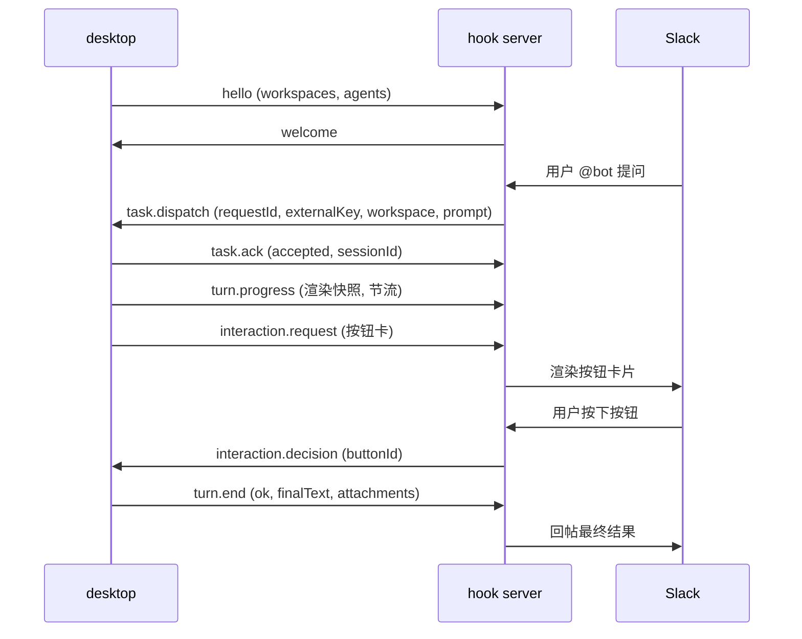

# slack-hook-protocol — hook server ↔ desktop 双工任务协议

> 包:`@cindy/slack-hook-protocol` · 协议版本 `HOOK_PROTOCOL_VERSION = 1` · 传输:WebSocket 文本帧(JSON)
> 两端:**desktop**(客户端,发起连接)与 **hook server**(外部渠道接入服务,当前渠道为 Slack 与协商启用的 Telegram)。包名本版保留以避免消费方迁移风险。

## 1. 协议模型(四幕 + v2 增量)

协议围绕「把 IM 渠道里的消息变成桌面端 agent 任务,再把结果送回渠道」设计:

1. **连接自报家门**:`hello`(desktop → server,声明工作区别名与可用 agent)/ `welcome` / `ping` / `pong`
2. **派活**:`task.dispatch`(server → desktop)→ `task.ack`(立即三态应答)
3. **干活**:无消息——铁律「同 externalKey 同 session」由 desktop 侧保证
4. **交差**:`turn.end`(desktop → server,结果回传)

v2 在版本号不变的前提下增量扩展(见 §3 兼容策略):

5. **绑定**:`bind.start` / `bind.update` / `bind.revoke` —— Slack 用户 ↔ 设备的建立与解除(Sign in with Slack OIDC)
6. **问答**:`query.request` / `query.response` —— `/bind` `/model` `/effort` 指令实时拉取工作区 / 模型清单
7. **取消**:`task.cancel` —— `/stop` 中断在跑任务,desktop 以 `turn.end(cancelled)` 收口
8. **归档**:`session.archive` —— 私聊 `/new` 换代后归档旧代会话
9. **进度**:`turn.progress` —— turn 执行中的渲染快照(节流,整帧替换语义)
10. **交互**:`interaction.request` / `interaction.decision` / `interaction.cancel` —— agent 执行中的用户交互(提问 / 计划审阅 / 权限审批)以按钮卡片转发到渠道
11. **偏好**:`prefs.get` / `prefs.set` / `prefs.state` —— server 侧目录偏好(agent/model/effort/permission)的远程读写
12. **工具**:`tool.request` / `tool.response` —— desktop 会话内 agent 调用 server 侧 Slack 网关工具(server 以绑定用户托管的 user token 执行);能力协商靠 `welcome.features` 的 `HOOK_FEATURE_SLACK_TOOLS`
13. **多 workspace 绑定(multi-team)**:`bind.state` 快照帧 + 各帧可选 `teamId` —— 一台设备可同时持有多个 (teamId, slackUserId) 绑定;能力协商双向(`hello.features` / `welcome.features` 的 `HOOK_FEATURE_MULTI_TEAM`),任一侧缺席回落单绑定行为
14. **多 provider**:`provider.bind.*` / `provider.prefs.*` —— 在不改变 Slack 旧帧的前提下追加统一的 provider 绑定与偏好通道
15. **最近会话**:`query.kind=sessions` —— Telegram `/session` 仅拉取最多 20 条脱敏会话摘要

## 2. 核心设计原则

- **externalKey 不透明**:对协议是不透明字符串,由 hook server 的 provider 生成(格式约定 `<providerId>:...`),desktop 只拿它查 session 映射并原样回传。
- **workspace 是别名**:本地绝对路径只存在于 desktop,**永不过网线**。server 只能派发 `hello` 注册过的别名。
- **决策语义留在 desktop**:交互卡(阶段 10)中 server 是"哑渲染器"——渲染卡片、回传 `buttonId`,按钮到决策的映射、超时与安全默认全部由 desktop 持有。
- **确定性靠代码不靠对端自觉**:两端收帧唯一入口是 `parseHookMessage`,手写校验、零依赖、坏帧返回 `ok:false` + 字段路径,绝不抛异常。
- **sessionId 仅接管时指定**:普通流程 `task.dispatch.sessionId` 恒 null(按 externalKey 定位);非 null 表示接管已有桌面会话。ack / turn.end 中回传仅作记录,不参与路由。
- **provider 能力必须双向协商**:只有 hello 与 welcome 同时包含 `provider-bind-v1` / `provider-prefs-v1` / `session-picker-v1` 时才可使用对应新增帧;Telegram 还要求 server 的 welcome 包含 `provider:telegram`。任一能力缺席都隐藏 Telegram 并完整回落现有 Slack 路径。
- **provider 偏好隔离**:`provider.prefs.*` 用 `provider + bindingId/scopeId + workspace` 定位,不会读取或覆写旧 `prefs.*` 的 Slack 行。provider-neutral 条目刻意不含 `teamId`。

## 3. 信封与兼容策略

每一帧都是同一形状的信封:

```ts
interface HookEnvelope<TType, TPayload> {
  v: number; // 恒为 HOOK_PROTOCOL_VERSION(1),不等直接拒收
  type: TType; // 消息类型,见 §5
  id: string; // 发送方生成的帧唯一标识(日志/去重);业务关联一律走 payload.requestId
  ts: number; // 发送方时钟 unix ms,仅供诊断
  payload: TPayload;
}
```

**兼容策略(重要,扩展协议前必读)**:

- `v` 固定为 1,靠以下两条实现无版本号演进:
  - **type 是开放集合**:老端收到未知 `type` **丢帧不断连**。新消息类型天然向后兼容(功能降级但不致故障)。
  - **字段级宽容**:校验器只查已知字段,未知字段静默忽略(如 `turn.end.attachments` 对旧 server);新增可选字段的缺省行为必须定义(如 `bind.update.installUrl` 缺省回退通用链接)。
- 本次只追加新消息类型、能力字符串和 `query.kind=sessions`;既有 `bind.*` / `prefs.*` 类型、字段与构造结果保持不变。老端会丢弃未知 provider 帧,新端在能力缺席时不会发送它们。
- 帧上限 `HOOK_MAX_FRAME_CHARS = 48 MiB`(JSON 序列化后字符数)。纯防 OOM 的粗防御,取"能容纳几张聊天截图的 base64"的宽上限;附件精细限额由生产源头(provider)负责。

## 4. 可靠性语义

- **requestId 幂等**:任务重投不重跑,desktop 只回放上次 ack。
- **断线重连**:server 重投未 ack 的任务;desktop 补发未送达的 `turn.end`。
- **latest-wins 帧**(`turn.progress` / `prefs.state` 主动推送):丢帧无害,每帧整体替换,不拼接不累积。
- **幂等收口**:`task.cancel` 对未知 requestId、`session.archive` 对不存在的会话、`interaction.decision` 对已收口交互——全部静默忽略。

## 5. 消息目录

### 阶段 1 连接与身份

| 消息            | 方向             | 用途 / 关键字段                                                                                                                                                                                                                                                                                          |
| --------------- | ---------------- | -------------------------------------------------------------------------------------------------------------------------------------------------------------------------------------------------------------------------------------------------------------------------------------------------------- |
| `hello`         | desktop → server | 建连后第一帧。`protocolVersion`、`deviceId`、`deviceName`、`workspaces`(注册的别名列表;首位恒为内置对话伪目录 `HOOK_CHAT_WORKSPACE_ALIAS='chat'`)、`agents`(可用 agent 类型)、可选 `features`(desktop 侧能力标识,如 `HOOK_FEATURE_MULTI_TEAM`)。别名映射变更后重发 hello 即时生效(server 以最新一帧为准) |
| `welcome`       | server → desktop | 握手完成。`serverName`、`features`(server 侧能力标识:`HOOK_FEATURE_SLACK_TOOLS` / `HOOK_FEATURE_MULTI_TEAM`;空数组 = 均不支持)                                                                                                                                                                           |
| `ping` / `pong` | 双向             | 心跳,收到 ping 必须回 pong。payload 恒空对象                                                                                                                                                                                                                                                             |

### 阶段 2/4/7/9 任务生命周期

| 消息            | 方向             | 用途 / 关键字段                                                                                                                                                                                                                                                                                               |
| --------------- | ---------------- | ------------------------------------------------------------------------------------------------------------------------------------------------------------------------------------------------------------------------------------------------------------------------------------------------------------- |
| `task.dispatch` | server → desktop | 派发任务。`requestId`、`externalKey`、`workspace`(sessionId 为 null 时必填)、`sessionId`(接管时非 null)、`prompt`、`options`(model/permissionMode/agentKind/effort 全可空,空落 desktop 默认)、`attachments`(base64 内联图片)、`source`(IM 来源元数据:平台、频道名、thread 上下文、用户原文)                   |
| `task.ack`      | desktop → server | dispatch 立即应答,三态 `accepted / queued / rejected`。联动约束(parse 强制):`reason` 仅 rejected 非 null;`queuePosition` 仅 queued 非 null;`sessionId` 在 accepted/queued 为目标会话、rejected 为 null。拒绝原因:`unknown_workspace` / `workspace_not_allowed` / `session_not_found` / `disabled` / `invalid` |
| `turn.progress` | desktop → server | 执行中渲染快照(完整 markdown,整帧替换)。desktop 负责节流(约 1.5s/帧)与长度控制                                                                                                                                                                                                                                |
| `task.cancel`   | server → desktop | 中断在跑任务(`/stop`)。desktop 中断对应 turn,以 `turn.end(cancelled)` 收口                                                                                                                                                                                                                                    |
| `turn.end`      | desktop → server | 任务收口。`status`:`ok / error / cancelled`(联动:ok 时 errorMessage 必须 null,error 时必须非空);`finalText`;`usage.durationMs`(拿不到就 null,不编造);`attachments`(agent 产出的图片/文件,出站与入站对称复用 TaskAttachment)                                                                                   |

### 阶段 5 绑定(Sign in with Slack OIDC)

| 消息          | 方向             | 用途 / 关键字段                                                                                                                                                                                                                                                                                                         |
| ------------- | ---------------- | ----------------------------------------------------------------------------------------------------------------------------------------------------------------------------------------------------------------------------------------------------------------------------------------------------------------------- |
| `bind.start`  | desktop → server | 发起绑定。新端发空对象 `{}`(设备身份取连接 hello 的 deviceId);可选 `teamId` = 给指定 team 重新授权时 pin 授权页(缺省 = 用户在授权页自选);`email` 字段仅用于 server 识别旧客户端(deprecated)                                                                                                                             |
| `bind.update` | server → desktop | 绑定状态机推送:`none / pending / confirmed / denied / expired / failed / revoked`。联动:pending 时 `authorizeUrl` 非空;confirmed 时 `slackUserId` 非空(可选 `teamName`);failed 时 `message` 非空,可选结构化 `reason`(已知值 `not-installed`,配 `installUrl`)。可选 `teamId`:事件按 team 定位(pending 期团队未知为 null) |
| `bind.revoke` | desktop → server | 解除绑定。`{ teamId?, pendingOnly? }`:`teamId` 非空 = 只解绑该 team,空/缺省 = 解绑本设备全部(兼容单绑定老语义);`pendingOnly=true` = 只作废在途授权、不动已确认绑定。desktop 仅在 server 声明 multi-team 后才发带 `teamId` 的形态                                                                                        |
| `bind.state`  | server → desktop | (multi-team)绑定全量快照(权威列表):`bindings[]` 每项 `{ teamId, teamName, slackUserId, slackUserName }`。连接建立与任何绑定变化(新增/解除/被顶)后推送;旧 desktop 不认识本类型,丢帧不断连                                                                                                                                |

### 阶段 6 实时问答

| 消息             | 方向             | 用途 / 关键字段                                                                                                                                                                          |
| ---------------- | ---------------- | ---------------------------------------------------------------------------------------------------------------------------------------------------------------------------------------- |
| `query.request`  | server → desktop | 拉清单。`queryId`(server 生成,响应回传配对,server 自行超时)、`kind`:`workspaces / models / sessions`                                                                                     |
| `query.response` | desktop → server | 应答。`ok=false` 时 `error` 非空;ok 时按 kind 携带 `workspaces`、`agents` 或 `sessions`。sessions 最多 20 条 `{id,title,workspace,lastActiveAt}`,workspace 只能是别名,校验器拒绝绝对路径 |

### Provider-neutral 绑定与偏好

| 消息                                           | 方向             | 用途 / 关键字段                                                                                                                                                                                                                                                                                                                                                                            |
| ---------------------------------------------- | ---------------- | ------------------------------------------------------------------------------------------------------------------------------------------------------------------------------------------------------------------------------------------------------------------------------------------------------------------------------------------------------------------------------------------ |
| `provider.bind.start`                          | desktop → server | 按 provider 发起一次绑定尝试;`requestId` 配对,`scopeId` 可选                                                                                                                                                                                                                                                                                                                               |
| `provider.bind.cancel`                         | desktop → server | 只取消指定 `attemptId`,不影响任何 confirmed binding                                                                                                                                                                                                                                                                                                                                        |
| `provider.bind.revoke`                         | desktop → server | 只解除指定 `bindingId`                                                                                                                                                                                                                                                                                                                                                                     |
| `provider.bind.update` / `provider.bind.state` | server → desktop | 共用完整快照形状。状态:`none → pending → awaiting_confirmation? → confirmed`;终态:`denied / expired / failed / revoked / superseded`。pending 必带 HTTPS `connectUrl`、attemptId、expiresAt;confirmed 必带 bindingId、principalId、scopeId;denied/expired/failed 必带机器可读 reason 并清空 binding/principal/expiry 字段;revoked/superseded 保留 bindingId 但必须清空 attemptId/expiresAt |
| `provider.prefs.get` / `provider.prefs.set`    | desktop → server | 用 provider 与且仅一个 bindingId/scopeId 选择偏好域;set 再按 workspace alias 部分更新，校验器拒绝绝对路径                                                                                                                                                                                                                                                                                  |
| `provider.prefs.state`                         | server → desktop | 同一偏好域的全量快照;`bound=false` 时 prefs 必为空，workspace 同样只允许 alias                                                                                                                                                                                                                                                                                                             |

`actions` 是 UI 能力提示,当前值包括 `open_connect_url`、`copy_connect_url`、`cancel`、`retry`、`revoke`、`open_provider`、`add_to_group`;消费者必须忽略未来未知 action。链接仍需由 host 做 provider-specific allowlist 校验,例如 Telegram 客户端只接受严格的 `https://t.me/<bot>?start=<token>`。

### 阶段 8 会话归档

| 消息              | 方向             | 用途                                                                   |
| ----------------- | ---------------- | ---------------------------------------------------------------------- |
| `session.archive` | server → desktop | 归档 externalKey 绑定的会话。desktop 幂等:无绑定/不存在/已归档静默忽略 |

### 阶段 10 执行中交互

| 消息                   | 方向             | 用途 / 关键字段                                                                                                                                                                                                                                                                  |
| ---------------------- | ---------------- | -------------------------------------------------------------------------------------------------------------------------------------------------------------------------------------------------------------------------------------------------------------------------------- |
| `interaction.request`  | desktop → server | 转发 agent 交互为渠道无关卡片:`requestId`(定位回帖 thread)、`interactionId`(决策配对键)、`kind`(开放集合:`ask_user_question` / `plan_review` / 权限审批等,server 只透传不理解)、`title`、`body`(markdown)、`buttons`(≤ `MAX_INTERACTION_BUTTONS`=24;按钮 id 卡内唯一且不含 `\|`) |
| `interaction.decision` | server → desktop | 用户按了按钮,回传 `buttonId`。desktop 查自己登记的按钮→决策映射;迟到/未知静默忽略                                                                                                                                                                                                |
| `interaction.cancel`   | desktop → server | 交互已在 desktop 收口(超时自决/turn 结束),通知 server 改写卡片(摘按钮 + reason 文案),防止用户按死卡片。幂等                                                                                                                                                                      |

### 阶段 11 目录偏好

| 消息          | 方向             | 用途 / 关键字段                                                                                                 |
| ------------- | ---------------- | --------------------------------------------------------------------------------------------------------------- |
| `prefs.get`   | desktop → server | 拉取绑定用户全部目录偏好。`requestId` 由 `prefs.state.replyTo` 回显配对                                         |
| `prefs.set`   | desktop → server | 部分更新某目录偏好(undefined 不动、null 显式清空)。server 只做 shape 校验不校验值合法性                         |
| `prefs.state` | server → desktop | 全量快照。`replyTo` 回显请求 id;主动推送(渠道 `/model` 卡写入后)为 null。联动:`bound=false` 时 `prefs` 恒空数组 |

### 阶段 12 Slack 网关工具

| 消息            | 方向             | 用途 / 关键字段                                                                                                                                                                                                                                                               |
| --------------- | ---------------- | ----------------------------------------------------------------------------------------------------------------------------------------------------------------------------------------------------------------------------------------------------------------------------- |
| `tool.request`  | desktop → server | 调用 server 侧 Slack 网关工具。`requestId`(desktop 生成,response 回显配对)、`tool`(开放集合,当前约定 `status` / `listTools` / `callTool`;未知值 server 回 `UNKNOWN_TOOL` 而非丢帧)、可选 `args`。发送前先查 `welcome.features` 是否含 `HOOK_FEATURE_SLACK_TOOLS`,缺席直接短路 |
| `tool.response` | server → desktop | 应答。`replyTo` 回显 requestId;联动(parse 强制):`ok=false` 时 `error` 必须为非空 `{code, message}`(desktop 按 code 分支,不解析文案),`ok=true` 时 `error` 缺席或 null,`result` 形状由具体工具约定                                                                              |

### 阶段 13 多 workspace 绑定(multi-team)增量

新帧 `bind.state` 见阶段 5 表。其余为已有帧的可选 `teamId` 扩展(多绑定下的归属消歧,缺省 = 设备唯一绑定的旧语义):`bind.start` / `bind.update` / `bind.revoke`(见阶段 5)、`prefs.set` 与 `prefs.state` 条目、`tool.request`、`task.dispatch.source`(`teamId` + `teamName`,供会话标题与工具默认 team)。能力协商双向:desktop 在 `hello.features`、server 在 `welcome.features` 各自声明 `HOOK_FEATURE_MULTI_TEAM`,任一侧缺席则整体回落单绑定行为。

## 6. 典型时序



## 7. 附件与图片 MIME 白名单

- 入站(dispatch)与出站(turn.end)附件对称复用 `TaskAttachment`:`{ name, mimeType, dataBase64 }`,base64 内联复用已鉴权的 WS 通道,不另开 HTTP 端点。
- `SUPPORTED_IMAGE_MIME_TYPES = png / jpeg / gif / webp` 是协议层权威单一来源(与 agent vision 实际接受集合一致);两端都据 `isSupportedImageMime()` 过滤(`image/jpg` 归一为 `image/jpeg`),防止一端宽一端窄导致图片传输后被对端静默丢弃。

## 8. 包 API

| 导出                            | 说明                                                                                                                                                                                                                                                                                                                                                                                                        |
| ------------------------------- | ----------------------------------------------------------------------------------------------------------------------------------------------------------------------------------------------------------------------------------------------------------------------------------------------------------------------------------------------------------------------------------------------------------- |
| `parseHookMessage(raw)`         | 两端收帧唯一入口。接受 WS 文本帧或已 parse 的对象;返回 `{ok:true, message}` 或 `{ok:false, error}`(带字段路径),不抛异常                                                                                                                                                                                                                                                                                     |
| `isHookMessageType(v)`          | type 集合守卫                                                                                                                                                                                                                                                                                                                                                                                               |
| `make*()`                       | 每种消息的构造器(自动填 `v` / `id` / `ts`)                                                                                                                                                                                                                                                                                                                                                                  |
| `serializeHookMessage(message)` | 序列化为 WS 文本帧                                                                                                                                                                                                                                                                                                                                                                                          |
| 常量                            | `HOOK_PROTOCOL_VERSION` / `HOOK_MAX_FRAME_CHARS` / `HOOK_MESSAGE_TYPES` / `HOOK_PROVIDERS` / `PROVIDER_BIND_STATES` / `HOOK_FEATURE_PROVIDER_*` / `HOOK_FEATURE_SLACK_TOOLS` / `HOOK_FEATURE_MULTI_TEAM` / `HOOK_CHAT_WORKSPACE_ALIAS` / `TASK_ACK_RESULTS` / `TASK_REJECT_REASONS` / `TURN_END_STATUSES` / `BIND_UPDATE_STATES` / `QUERY_KINDS` / `MAX_INTERACTION_BUTTONS` / `SUPPORTED_IMAGE_MIME_TYPES` |

注:`build.ts` 使用 `node:crypto`,本包面向 Node 环境(desktop main 进程 / hook server),**不承诺 React Native 兼容**。

## 9. 扩展指南

1. 新消息类型:加进 `HOOK_MESSAGE_TYPES` → 定义 payload 接口与联动约束 → `parse.ts` 加校验器(错误信息带字段路径)→ `build.ts` 加构造器 → 补测试。老端丢帧不断连,天然向后兼容,但必须为"对端是旧版"定义降级行为(参考 prefs.get 的超时降级)。
2. 已有消息加字段:一律可选字段;校验器只校验已知字段;必须写清缺省时两端各自的回退行为。
3. 不兼容改动(信封结构 / 语义变更):升 `HOOK_PROTOCOL_VERSION`,并同窗升级两端——这是最后手段,优先走 1/2。
